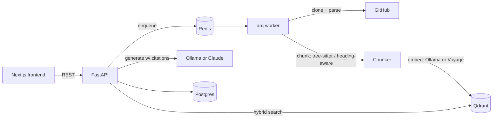

# RepoLens

[](https://github.com/prashantkoirala465/repolens/actions/workflows/ci.yml)
[](LICENSE)

Ask questions about any public GitHub repo and get answers cited to the exact
file and line range they came from. Same category as Sourcegraph Cody's `ask`
or Cursor's `@codebase` — the difference is that retrieval quality here is
something you can measure, not something you have to take on faith.

**Status:** Feature-complete and CI-green — clone → chunk → embed → index →
hybrid retrieval → cited answer, end to end. Retrieval quality is measured,
not asserted (see [Measuring retrieval quality](#measuring-retrieval-quality)),
and the service is hardened for real traffic: rate limiting, request-
correlated structured logging, an integration suite against live
Postgres/Redis/Qdrant in CI (see [Security](#security)). All four planned
phases are done — see [Roadmap](#roadmap) for how it got here.

## The problem

Every RAG demo answers questions. Almost none of them tell you whether the
answers are backed by the right source material or by something that merely
shares vocabulary with the question. That gap is invisible until it isn't —
usually in front of the person you built the thing for. RepoLens is built
around treating retrieval quality as a number you track, not a property you
assume.

## What it does

1. Paste a public GitHub repo URL.
2. It's shallow-cloned, walked, and chunked — code by AST (tree-sitter, so a
   chunk is always a complete function/class, never a truncated fragment),
   docs by heading.
3. Chunks are embedded (locally via Ollama by default, or Voyage's
   code-specialized model in the cloud path) and indexed into Qdrant with
   both a dense vector and a BM25 sparse vector.
4. Ask a question. Retrieval fuses dense + BM25 search server-side
   (`RETRIEVAL_MODE=hybrid` by default — see
   [Measuring retrieval quality](#measuring-retrieval-quality) for why). The
   answer is generated only from retrieved chunks, and every citation is
   checked server-side against what was actually retrieved before the
   response goes out — see [Security](#security).



## Design decisions

The non-obvious calls in this codebase, and the reasoning behind them:

- **Voyage's `voyage-code-3`** over a general-purpose text embedder — it
  measurably outperforms on code-retrieval benchmarks, the exact workload
  this project has.
- **Qdrant over pgvector** so hybrid BM25 + dense search is a first-class,
  server-side capability instead of hand-rolled application logic.
- **Hand-rolled BM25 term-frequency vectors** (`retrieval/sparse.py`)
  instead of `fastembed`'s reference `Qdrant/bm25` model — its
  `onnxruntime`/`Pillow` dependencies are overhead for neural embedders
  this project never uses, when the actual client-side job (Qdrant computes
  IDF server-side) is just tokenize-count-saturate, well inside the
  standard library.
- **Tree-sitter AST chunking** instead of splitting on a fixed line count,
  so a chunk is always a complete function or class — never truncated
  mid-body — with naive fixed-width chunking kept only as a fallback for
  unsupported or unparseable files.
- **arq over Celery** for background indexing, since the job shape (one
  async pipeline, report status) doesn't need Celery's routing/chains
  machinery.
- **Server-side citation validation** — every citation the model emits is
  checked against what was actually retrieved, which is the real defense
  against prompt injection from untrusted repo content, not an attempt to
  detect the injection itself; see [Security](#security).
- **Ollama as the default provider** for both embeddings and generation, so
  the app runs with zero API keys and zero cost, with Voyage and Anthropic
  available as an opt-in upgrade.

## API surface

| Method | Path                  | Description                                 |
| ------ | --------------------- | -------------------------------------------- |
| POST   | `/repos`              | Index a repo (idempotent per `github_url`)  |
| GET    | `/repos/{id}`         | Poll indexing status                        |
| POST   | `/repos/{id}/query`   | Ask a question, get a cited answer          |
| GET    | `/health`             | Liveness                                    |

## Getting started

### Prerequisites

- Docker and Docker Compose
- [Ollama](https://ollama.com), running on the host — the default provider
  path doesn't use any cloud API, but it does need Ollama installed
  natively rather than in Docker: containers on macOS run in a Linux VM
  with no GPU passthrough, so a containerized Ollama would be CPU-only and
  dramatically slower

### Quickstart

```bash
ollama pull nomic-embed-text
ollama pull llama3.2
cp .env.example .env
docker compose up
```

The API comes up on `:8000`, the frontend on `:3000`. Postgres/Redis/Qdrant
are health-checked and the app services wait on them before starting.

Want better retrieval/answer quality and don't mind paying for it? Set
`EMBEDDING_PROVIDER=voyage` and/or `GENERATION_PROVIDER=anthropic` in `.env`
and fill in the matching API key — everything else stays the same.

### Development

Running the backend and frontend directly (against the Postgres/Redis/Qdrant
containers, without rebuilding a Docker image on every change):

```bash
# backend — needs uv (https://docs.astral.sh/uv/)
cd backend
uv sync
uv run alembic upgrade head
uv run uvicorn repolens.main:app --reload

# frontend — needs pnpm
cd frontend
pnpm install
pnpm dev
```

Checks that run in CI, runnable locally the same way:

```bash
cd backend
uv run ruff check . && uv run ruff format --check .
uv run mypy src
uv run pytest tests/unit -v

cd frontend
pnpm run lint
pnpm run test
pnpm run build
```

Backend integration tests (`tests/integration`) run in CI against real
Postgres/Redis/Qdrant service containers — no Ollama needed, a fake
Embedder/Generator (`tests/integration/conftest.py`) stand in, so what's
under test is the pipeline wiring, not model quality. Runnable locally
against your own Postgres/Redis/Qdrant:

```bash
uv run alembic upgrade head
uv run pytest tests/integration -v
```

## Project layout

```
backend/src/repolens/
├── api/routes/     # FastAPI routers: repos, query, health
├── chunking/       # tree-sitter AST chunking + fallback, markdown chunking
├── core/            # settings, rate limiting, request-correlation middleware
├── embeddings/      # Embedder protocol, Ollama + Voyage implementations
├── eval/            # retrieval benchmark, metrics, repolens-eval CLI
├── generation/      # Generator protocol, Ollama + Anthropic, citation validation
├── retrieval/       # Qdrant collection mgmt, hybrid (BM25 + dense) search
├── services/        # git cloning, the indexing pipeline
├── workers/         # arq worker entrypoint and task
└── db/              # SQLAlchemy models, session

frontend/src/
├── app/             # Next.js routes: repo submission, repo workspace
├── components/      # RepoForm, QueryPanel, RetrievalInspector, StatusBadge
└── lib/             # API client, TanStack Query provider
```

## Measuring retrieval quality

Retrieval quality claims are worthless without a benchmark to back them, so
this project has one: `repolens-eval`, a CLI that indexes a repo pinned at
an exact commit, runs a hand-verified set of questions against it, and
scores the results with precision@k, recall@k, MRR, and nDCG@k — not
assertions in a test suite, actual numbers from an actual retrieval run.

Ground truth is a set of `(file_path, start_line, end_line)` answer
locations per question, not exact `chunk_id`s — a retrieved chunk counts as
relevant if it overlaps a labeled span, which survives minor chunk-boundary
drift without needing the benchmark relabeled. The shipped benchmark
(`backend/src/repolens/eval/benchmarks/requests.json`) has 15 questions
against [`psf/requests`](https://github.com/psf/requests) pinned at a fixed
commit — each one checked by actually chunking the real source at that
commit, not by guessing line numbers.

```bash
cd backend
uv run repolens-eval run \
  --benchmark src/repolens/eval/benchmarks/requests.json --mode dense \
  --out results/dense.json

uv run repolens-eval run \
  --benchmark src/repolens/eval/benchmarks/requests.json --mode hybrid \
  --out results/hybrid.json

uv run repolens-eval diff results/dense.json results/hybrid.json
```

`run` indexes the benchmark's pinned commit into a Qdrant id scoped to that
run (`eval:{owner}/{name}@{commit}`), completely isolated from anything
indexed through the app, and writes per-question and aggregate metrics
alongside the config that produced them (retrieval mode, embedding
provider/model, k values). `--mode` is independent of the app's own
`RETRIEVAL_MODE` — the entire point is comparing two strategies side by
side. `diff` compares two result files and flags any question whose MRR or
recall regressed.

This is exactly how Phase 3 (hybrid retrieval) got decided — not asserted.
Dense-only vs. hybrid (BM25 + dense, RRF fusion), same pinned commit, same
`ollama`/`nomic-embed-text` embeddings:

| metric | dense@5 | hybrid@5 | dense@10 | hybrid@10 |
| --- | --- | --- | --- | --- |
| precision | 0.173 | 0.160 | 0.107 | 0.100 |
| recall | 0.644 | 0.644 | 0.844 | 0.844 |
| nDCG | 0.461 | 0.514 | 0.531 | 0.579 |

MRR: 0.481 (dense) → 0.552 (hybrid). Not a clean sweep — precision dips
slightly at both cutoffs, and 3 of the 15 questions individually regressed
on MRR (`session-cookie-persistence`, `session-setting-merge`,
`digest-auth-401-retry`). But recall is unchanged and both ranking-quality
metrics improve meaningfully: hybrid finds the same relevant chunks and
ranks them higher on average. That's what earned `RETRIEVAL_MODE=hybrid`
its default — a net win, reported in full rather than cherry-picked.

## Security

Indexing an arbitrary public repo means untrusted code and text flows through
the pipeline. What's bounded, and how:

- **Resource limits at index time** — max repo size, max file size, clone
  timeout, max files per repo (`services/git.py`, `chunking/walker.py`). No
  repo content is ever executed; tree-sitter only parses.
- **Prompt injection at query time** — a malicious README could contain text
  aimed at whatever eventually reads it. Retrieved chunks are framed as data,
  never as instructions, in the system prompt. More importantly, every
  citation the model emits is checked against the actual retrieved set before
  the response returns. The practical effect: an injected instruction can
  make the model say something wrong, but it can't forge evidence for a
  claim and there's no action surface for it to abuse.
- **Rate limiting** — Redis-backed (`slowapi`, reusing arq's already-deployed
  Redis rather than in-memory limits, which aren't correct once there's more
  than one uvicorn worker process) on the two routes with real compute/cost
  behind them: `POST /repos` (clone + embed) and `POST .../query`
  (generation). Configurable via `RATE_LIMIT_REPOS`/`RATE_LIMIT_QUERY`,
  defaulting to 5/minute and 20/minute.
- **CI security scanning** — `gitleaks` on every push/PR for committed
  secrets, `pip-audit` against the resolved backend dependency set.

Every request also gets a `request_id` (from `X-Request-ID`, or a fresh one)
bound to every log line it produces — including from deep inside
chunking/embedding helpers, not just the route handler — plus one structured
`http.request` access log with status and duration. Useful for security
review as much as debugging: a suspicious sequence of requests is
one `request_id` to grep for, not a set of timestamps to correlate by hand.

## Roadmap

- ~~**Core pipeline (Phase 1)**~~ — done; clone → chunk → embed → index →
  query → cited answer, end to end, with unit tests and CI green on every
  push.
- ~~**Eval harness (Phase 2)**~~ — done; see
  [Measuring retrieval quality](#measuring-retrieval-quality).
- ~~**Hybrid retrieval (Phase 3)**~~ — done; BM25 + dense fusion via Qdrant's
  Query API, on by default after measuring a net win over the Phase 2
  dense-only baseline — see
  [Measuring retrieval quality](#measuring-retrieval-quality).
- ~~**Hardening (Phase 4)**~~ — done; Redis-backed rate limiting, request-
  correlated structured logging, and a real integration suite (`tests/integration`)
  against live Postgres/Redis/Qdrant, on in CI — see [Security](#security).
- Not planned: multi-tenant auth, private-repo support. This is a portfolio
  piece about retrieval quality, not a hosted product.

## License

MIT — see [LICENSE](LICENSE).
