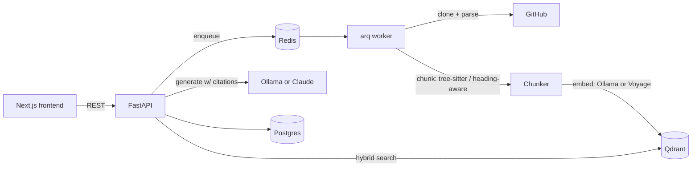

# RepoLens

[](https://github.com/prashantkoirala465/repolens/actions/workflows/ci.yml)
[](LICENSE)

Ask questions about any public GitHub repo and get answers cited to the exact
file and line range they came from. Same category as Sourcegraph Cody's `ask`
or Cursor's `@codebase` — the difference is that retrieval quality here is
something you can measure, not something you have to take on faith.

**Status:** Phase 1 of 5 complete — clone → chunk → embed → index → query →
cited answer works end to end, with unit tests and CI green on every push.
The eval harness (Phase 2, the actual point of this project) is next; see
[Roadmap](#roadmap).

## The problem

Every RAG demo answers questions. Almost none of them tell you whether the
answers are backed by the right source material or by something that merely
shares vocabulary with the question. That gap is invisible until it isn't —
usually in front of the person you built the thing for. RepoLens is built
around treating retrieval quality as a number you track, not a property you
assume.

## What it does

1. Paste a public GitHub repo URL.
2. It's shallow-cloned, walked, and chunked — code by AST (tree-sitter, so a
   chunk is always a complete function/class, never a truncated fragment),
   docs by heading.
3. Chunks are embedded and indexed into Qdrant — locally via Ollama by
   default (free, no API key), or Voyage's code-specialized model if you
   opt into the cloud path.
4. Ask a question. The answer is generated only from retrieved chunks, and
   every citation is checked server-side against what was actually retrieved
   before the response goes out — see [Security](#security).



## Design decisions

The non-obvious calls in this codebase, and the reasoning behind them:

Embeddings run on Voyage's `voyage-code-3` rather than a general-purpose text
embedder, because it measurably outperforms on code-retrieval benchmarks —
the exact workload this project has. Qdrant was picked over pgvector so
hybrid BM25 + dense search is a first-class, server-side capability instead
of hand-rolled application logic. Chunking walks the tree-sitter AST instead
of splitting on a fixed line count, so a chunk is always a complete function
or class — never truncated mid-body — with naive fixed-width chunking kept
only as a fallback for unsupported or unparseable files. Background indexing
runs on arq rather than Celery, since the job shape (one async pipeline,
report status) doesn't need Celery's routing/chains machinery. Every citation
the model emits is validated server-side against what was actually
retrieved, which is the real defense against prompt injection from untrusted
repo content — not an attempt to detect the injection itself; see
[Security](#security). Ollama is the default provider for both embeddings
and generation, so the app runs with zero API keys and zero cost, with
Voyage and Anthropic available as an opt-in upgrade.

## API surface

| Method | Path                | Description                                |
| ------ | ------------------- | ------------------------------------------- |
| POST   | `/repos`             | Index a repo (idempotent per `github_url`) |
| GET    | `/repos/{id}`        | Poll indexing status                       |
| POST   | `/repos/{id}/query`  | Ask a question, get a cited answer         |
| GET    | `/health`            | Liveness                                   |

## Getting started

### Prerequisites

- Docker and Docker Compose
- [Ollama](https://ollama.com), running on the host — the default provider
  path doesn't use any cloud API, but it does need Ollama installed
  natively rather than in Docker: containers on macOS run in a Linux VM
  with no GPU passthrough, so a containerized Ollama would be CPU-only and
  dramatically slower

### Quickstart

```bash
ollama pull nomic-embed-text
ollama pull llama3.2
cp .env.example .env
docker compose up
```

The API comes up on `:8000`, the frontend on `:3000`. Postgres/Redis/Qdrant
are health-checked and the app services wait on them before starting.

Want better retrieval/answer quality and don't mind paying for it? Set
`EMBEDDING_PROVIDER=voyage` and/or `GENERATION_PROVIDER=anthropic` in `.env`
and fill in the matching API key — everything else stays the same.

### Development

Running the backend and frontend directly (against the Postgres/Redis/Qdrant
containers, without rebuilding a Docker image on every change):

```bash
# backend — needs uv (https://docs.astral.sh/uv/)
cd backend
uv sync
uv run alembic upgrade head
uv run uvicorn repolens.main:app --reload

# frontend — needs pnpm
cd frontend
pnpm install
pnpm dev
```

Checks that run in CI, runnable locally the same way:

```bash
cd backend
uv run ruff check . && uv run ruff format --check .
uv run mypy src
uv run pytest tests/unit -v

cd frontend
pnpm run lint
pnpm run test
pnpm run build
```

Backend integration tests (`tests/integration`) run against real
Postgres/Redis/Qdrant service containers; they're wired into `ci.yml` but
currently gated off (`if: false`) pending the Phase 1 integration suite.

## Project layout

```
backend/src/repolens/
├── api/routes/     # FastAPI routers: repos, query, health
├── chunking/       # tree-sitter AST chunking + fallback, markdown chunking
├── embeddings/      # Embedder protocol, Ollama + Voyage implementations
├── generation/      # Generator protocol, Ollama + Anthropic, citation validation
├── retrieval/       # Qdrant collection management and search
├── services/        # git cloning, the indexing pipeline
├── workers/         # arq worker entrypoint and task
└── db/              # SQLAlchemy models, session

frontend/src/
├── app/             # Next.js routes: repo submission, repo workspace
├── components/      # RepoForm, QueryPanel, RetrievalInspector, StatusBadge
└── lib/             # API client, TanStack Query provider
```

## Security

Indexing an arbitrary public repo means untrusted code and text flows through
the pipeline. What's bounded, and how:

- **Resource limits at index time** — max repo size, max file size, clone
  timeout, max files per repo (`services/git.py`, `chunking/walker.py`). No
  repo content is ever executed; tree-sitter only parses.
- **Prompt injection at query time** — a malicious README could contain text
  aimed at whatever eventually reads it. Retrieved chunks are framed as data,
  never as instructions, in the system prompt. More importantly, every
  citation the model emits is checked against the actual retrieved set before
  the response returns. The practical effect: an injected instruction can
  make the model say something wrong, but it can't forge evidence for a
  claim and there's no action surface for it to abuse.
- **CI security scanning** — `gitleaks` on every push/PR for committed
  secrets, `pip-audit` against the resolved backend dependency set.

## Roadmap

- **Eval harness (Phase 2)** — a hand-labeled benchmark (LLM-drafted
  candidates, human-verified) with precision@k/recall@k/MRR/nDCG, and an
  `eval diff` CLI to compare retrieval strategies with real numbers instead of
  assertions.
- **Hybrid retrieval (Phase 3)** — BM25 + dense fusion via Qdrant's Query API,
  measured against the Phase 1 baseline through the eval harness before it's
  called an improvement.
- **Hardening (Phase 4)** — rate limiting, structured observability, the
  currently-disabled integration suite turned on in CI.
- Not planned: multi-tenant auth, private-repo support. This is a portfolio
  piece about retrieval quality, not a hosted product.

## License

MIT — see [LICENSE](LICENSE).
