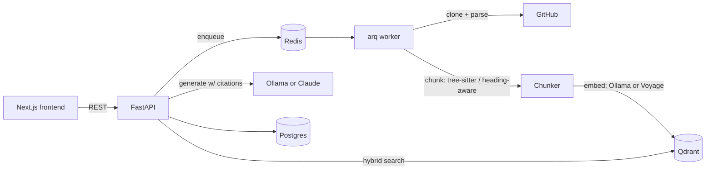

# RepoLens

Ask questions about any public GitHub repo and get answers cited to the exact
file and line range they came from. Same category as Sourcegraph Cody's `ask`
or Cursor's `@codebase` — the difference is that retrieval quality here is
something you can measure, not something you have to take on faith.

**Status:** Phase 1 of 5 complete — clone → chunk → embed → index → query →
cited answer works end to end. The eval harness (Phase 2, the actual point of
this project) is next; see [Roadmap](#roadmap) below.

## The problem

Every RAG demo answers questions. Almost none of them tell you whether the
answers are backed by the right source material or by something that merely
shares vocabulary with the question. That gap is invisible until it isn't —
usually in front of the person you built the thing for. RepoLens is built
around treating retrieval quality as a number you track, not a property you
assume.

## What it does

1. Paste a public GitHub repo URL.
2. It's shallow-cloned, walked, and chunked — code by AST (tree-sitter, so a
   chunk is always a complete function/class, never a truncated fragment),
   docs by heading.
3. Chunks are embedded and indexed into Qdrant — locally via Ollama by
   default (free, no API key), or Voyage's code-specialized model if you
   opt into the cloud path.
4. Ask a question. The answer is generated only from retrieved chunks, and
   every citation is checked server-side against what was actually retrieved
   before the response goes out — see [Security](#security).



## Design decisions

The non-obvious calls — and why — are written down as ADRs rather than left
to be reverse-engineered from the diff:

- [0001](docs/adr/0001-embeddings-voyage-code-3.md) — embeddings: Voyage
  `voyage-code-3` over OpenAI, on code-retrieval benchmark performance
- [0002](docs/adr/0002-vector-store-qdrant-over-pgvector.md) — vector store:
  Qdrant over pgvector, because hybrid search is core to the product
- [0003](docs/adr/0003-chunking-ast-aware-over-fixed-width.md) — chunking:
  AST-aware over fixed-width, with naive chunking as an explicit fallback
- [0004](docs/adr/0004-task-queue-arq.md) — task queue: arq
- [0005](docs/adr/0005-citation-validation-as-prompt-injection-defense.md) —
  citation validation as the actual prompt-injection defense
- [0006](docs/adr/0006-local-model-support-via-ollama.md) — local models
  (Ollama) as the default provider, cloud as opt-in

## API surface

| Method | Path                    | Description                                    |
| ------ | ------------------------ | ----------------------------------------------- |
| POST   | `/repos`                 | Index a repo (idempotent per `github_url`)      |
| GET    | `/repos/{id}`            | Poll indexing status                            |
| POST   | `/repos/{id}/query`      | Ask a question, get a cited answer              |
| GET    | `/health`                | Liveness                                        |

## Running it locally

Zero-cost default — [install Ollama](https://ollama.com), pull the two small
models the defaults expect, then bring up the stack:

```bash
ollama pull nomic-embed-text
ollama pull llama3.2
cp .env.example .env
docker compose up
```

The API comes up on `:8000`, the frontend on `:3000`. Postgres/Redis/Qdrant
are health-checked and the app services wait on them before starting; Ollama
itself runs on the host, not in Docker (see ADR-0006 for why).

Want better retrieval/answer quality and don't mind paying for it? Set
`EMBEDDING_PROVIDER=voyage` and/or `GENERATION_PROVIDER=anthropic` in `.env`
and fill in the matching API key — everything else stays the same.

## Security

Indexing an arbitrary public repo means untrusted code and text flows through
the pipeline. What's bounded, and how:

- **Resource limits at index time** — max repo size, max file size, clone
  timeout, max files per repo (`services/git.py`, `chunking/walker.py`). No
  repo content is ever executed; tree-sitter only parses.
- **Prompt injection at query time** — a malicious README could contain text
  aimed at whatever eventually reads it. Retrieved chunks are framed as data,
  never as instructions, in the system prompt. More importantly, every
  citation the model emits is checked against the actual retrieved set before
  the response returns — see ADR-0005. The practical effect: an injected
  instruction can make the model say something wrong, but it can't forge
  evidence for a claim and there's no action surface for it to abuse.

## Roadmap

- **Eval harness (Phase 2)** — a hand-labeled benchmark (LLM-drafted
  candidates, human-verified) with precision@k/recall@k/MRR/nDCG, and an
  `eval diff` CLI to compare retrieval strategies with real numbers instead of
  assertions.
- **Hybrid retrieval (Phase 3)** — BM25 + dense fusion via Qdrant's Query API,
  measured against the Phase 1 baseline through the eval harness before it's
  called an improvement.
- **Hardening (Phase 4)** — rate limiting, structured observability, full CI
  security scanning.
- Not planned: multi-tenant auth, private-repo support. This is a portfolio
  piece about retrieval quality, not a hosted product.

## License

MIT — see [LICENSE](LICENSE).
